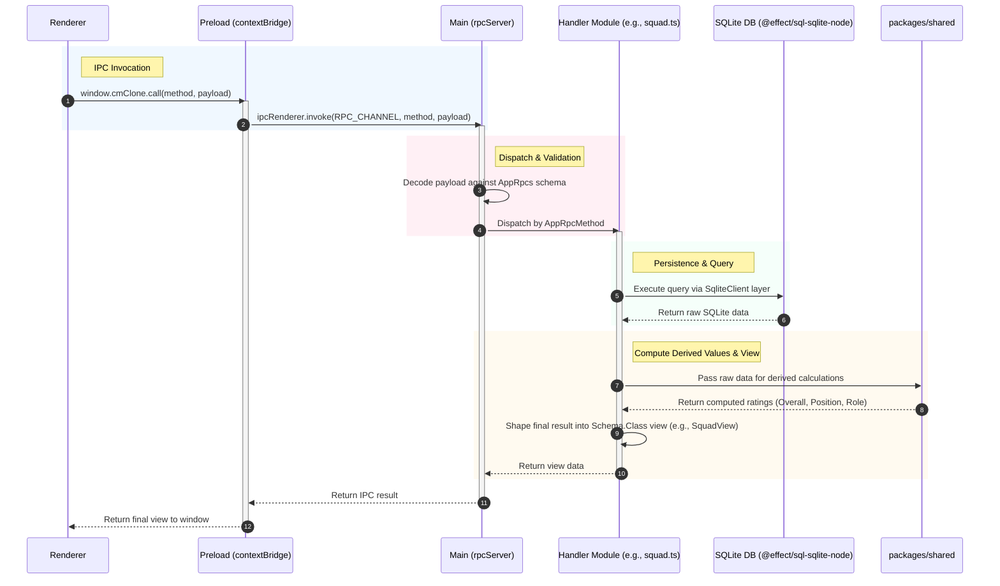

# cm-clone Architecture

A pnpm monorepo for a local, single-player Championship Manager-style Electron game. See
[CONTEXT.md](../CONTEXT.md) for the domain glossary and [.agents/notes/](../.agents/notes/) for the rationale behind
the decisions below.

## Packages

| Package | Role |
| --- | --- |
| `apps/desktop` | Electron shell: main process (RPC server, SQLite access, save/world generation), preload (`contextBridge`), and a React renderer. The only app — there is no separate server. |
| `packages/contracts` | The `@effect/rpc`-shaped `AppRpcs` `RpcGroup` (hand-rolled stand-in until a v4-compatible `@effect/rpc` ships) plus every `Schema.Class` payload/view/error the renderer and main process share. |
| `packages/game-engine` | Pure, DB-agnostic decider/projector/match-sim logic, unit-testable without Electron. Mostly a placeholder scaffold today; real deciders land as later tickets are implemented. |
| `packages/shared` | Game-design constants and pure functions with no Effect/Node dependency: Position/Role taxonomy, Attribute weights, ratings math, world generation. Imported directly by both the main process and the renderer. |

## Data flow

There is no event-sourced command/decider pipeline wired up yet for gameplay actions — `saves.ts`,
`squad.ts`, and `tactics.ts` currently read/write SQLite directly per RPC call, matching each
ticket's scope so far. The event-sourced Decider architecture described in
[domain-bounded deciders and chunked resimulation](../.agents/notes/implemented/architecture/2026-08-27-domain-bounded-deciders-and-chunked-resimulation.md) is where later
tickets (match engine, transfers, season/calendar) are expected to introduce it.

## What's implemented so far

| Area                | Files                                                   | Functionality                                                                                                                                                                                | Validation / Persistence                                                                                                                       |
| ------------------- | ------------------------------------------------------- | -------------------------------------------------------------------------------------------------------------------------------------------------------------------------------------------- | ---------------------------------------------------------------------------------------------------------------------------------------------- |
| **Save management** | `saves.ts` `worldGeneration.ts` `packages/shared` | Create, list, and load saves. Each save is backed by its own SQLite file. Creating a save generates the fixed 20-club League and each club's squad using `generateSquad` / `generatePlayer`. | Save data is persisted in its dedicated SQLite file.                                                                                           |
| **Squad screen**    | `squad.ts` `SquadScreen.tsx`                         | Lists the user's club's players. Displays computed **Overall Rating**, **per-Position Rating**, and the complete attribute breakdown.                                                        | Ratings are computed from the player's attributes.                                                                                             |
| **Tactics screen**  | `tactics.ts` `TacticsScreen.tsx`                     | Select one of the **5 v1 Formations**; assign squad players to the **11 formation slots**; automatically derive Role from Position; configure the **3 Team Instructions**.                   | Persisted through `ChangeTactics`. Server-side validation checks formation shape, Role/Position pairing, and duplicate players before writing. |

 Everything else in the v1 scope (match engine, transfers, season/calendar, board objectives) is
still only a spec under `.scratch/cm-clone/issues/` — see [CONTEXT.md](../CONTEXT.md) and the ADRs
for the intended shape before implementing it.

## Testing

- `packages/shared`, `packages/game-engine`, `apps/desktop` each run `vitest` (`@effect/vitest` for
  Effect-based tests) via `pnpm test` / `pnpm -r test`.
- `apps/desktop/e2e/` runs Playwright against the built Electron app (`pnpm build && playwright
  test`), covering full user flows (create a save, load the squad, set and persist a tactic, restart
  and reload).
